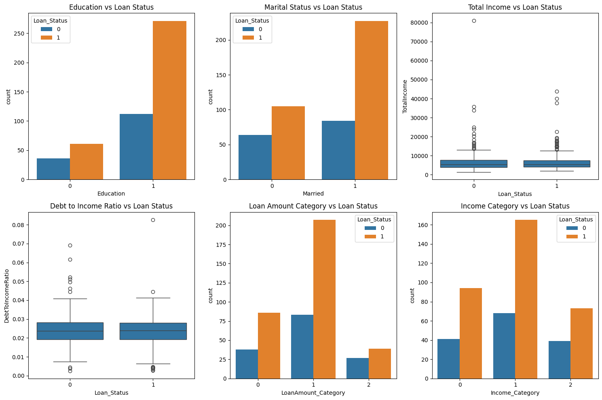
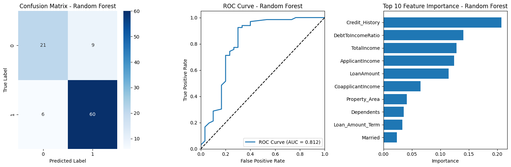
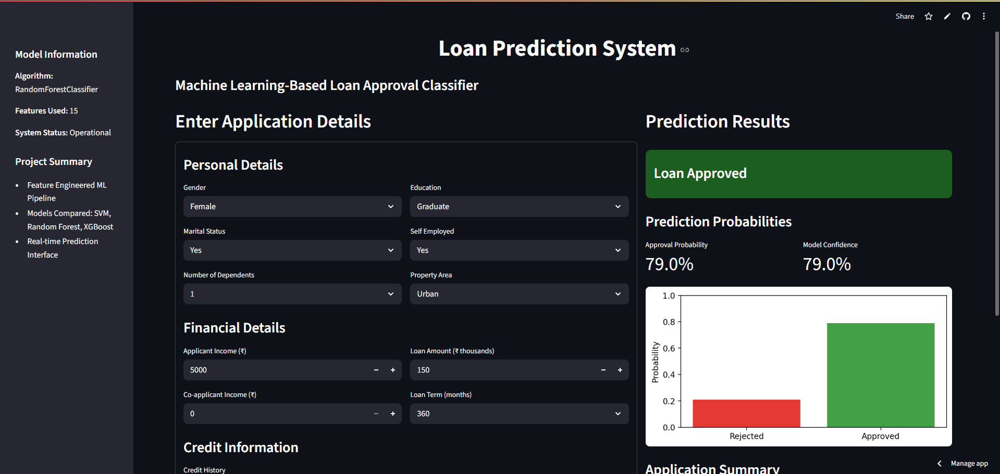
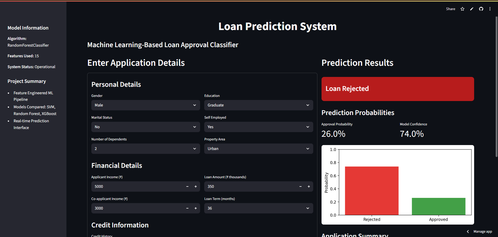

# Loan Prediction System

A complete machine learning pipeline for predicting loan approvals using advanced feature engineering, rigorous model comparison, and a production-ready web application.


## Live Demo

Access the deployed web application for real-time loan prediction:

**Web Application:** [https://anuragjoshi05-loan-prediction-app-app-brm8cx.streamlit.app/](https://anuragjoshi05-loan-prediction-app-app-brm8cx.streamlit.app/)

- Submit applicant details through an intuitive form
- Instantly get loan approval status and confidence score
- Powered by the best-performing ML model (XGBoost)
- Optimized for desktop and mobile devices

## Table of Contents

- [Overview](#overview)
- [Features](#features)
- [Tech Stack](#tech-stack)
- [Installation](#installation)
- [Usage](#usage)
- [Model Performance](#model-performance)
- [Deployment](#deployment)
- [Screenshots](#screenshots)

## Overview

This project showcases an end-to-end data science solution for predicting loan approvals using structured data. It includes robust preprocessing, feature engineering, multiple model comparisons, and a clean, user-friendly Streamlit interface designed for real-time predictions.

## Features

### Feature Engineering
- **TotalIncome**: Applicant + Co-applicant income
- **DebtToIncomeRatio**: Loan burden measurement
- **LoanAmount_Category**: Binned loan size (Low/Medium/High)
- **Income_Category**: Binned income levels (Low/Medium/High)
- **Categorical Encoding**: Robust and consistent mappings

### Machine Learning Models
- **Support Vector Machine** (Linear Kernel)
- **Random Forest** (100 trees)
- **XGBoost** (Hyperparameter-tuned)
- **Model Selection** based on evaluation metrics

### Model Evaluation
- Confusion matrix
- ROC-AUC curve
- Classification report (Precision, Recall, F1)
- Cross-validation scores
- Feature importance visualizations

### Web Application
- Interactive prediction form
- Real-time predictions with probabilities
- Clean dark-themed UI using Streamlit
- Deployable on Streamlit Cloud or Heroku

## Tech Stack

| Category | Technologies |
|----------|-------------|
| Programming | Python 3.8+ |
| ML Libraries | Scikit-learn, XGBoost, NumPy, Pandas |
| Visualization | Matplotlib, Seaborn |
| Web App Framework | Streamlit |
| Model Persistence | Joblib |
| IDE & Development | Jupyter Notebook, Google Colab |

## Installation

### Option 1: Run on Google Colab


```python
!pip install xgboost streamlit
# Upload dataset and execute training notebook
```
### Option 2: Run Locally
```
git clone https://github.com/yourusername/loan-prediction-system.git
cd loan-prediction-system
pip install -r requirements.txt
```
---

### Usage
#### Train the Models
```
python train_models.py
```
1. Preprocesses data
2. Engineers new features
3. Trains and evaluates models
4. Saves the best-performing model
#### Run the Web App
```
streamlit run app.py
```
```
Go to http://localhost:8501 to access the app.
```
#### Make Predictions
1. Fill in applicant details
2. Click "Predict Loan Status"
3. View prediction and confidence score

## 📈 Model Performance

| Metric              | Score   |
|---------------------|---------|
| Test Accuracy       | 83.3%   |
| F1 Score            | 0.85    |
| ROC-AUC Score       | 0.87    |
| Cross-Validation    | 5-Fold  |

---

## 🔍 Top 5 Important Features

| Feature             | Importance |
|---------------------|------------|
| Credit_History      | 0.35       |
| TotalIncome         | 0.18       |
| DebtToIncomeRatio   | 0.15       |
| LoanAmount          | 0.12       |
| Property_Area       | 0.08       |

---

## 🌐 Deployment

### Streamlit Cloud

1. Push code to GitHub  
2. Visit [streamlit.io/cloud](https://streamlit.io/cloud)  
3. Connect your GitHub repository  
4. Set file path to `app.py`  
5. Deploy and access your app

---

## 📸 Screenshots

### 📊 Data Visualization
  
*Exploratory Data Analysis with Seaborn and Matplotlib for understanding feature distributions and relationships.*

---

### 🧠 Model Comparison
  
*Side-by-side evaluation of SVM, Random Forest, and XGBoost with key metrics like accuracy and AUC.*

---

### ✅ Approved Loan Prediction (Streamlit)
  
*Live prediction interface showing approval result with confidence score.*

---

### ❌ Rejected Loan Prediction (Streamlit)
  
*Live prediction interface showing rejection result with detailed feedback.*


